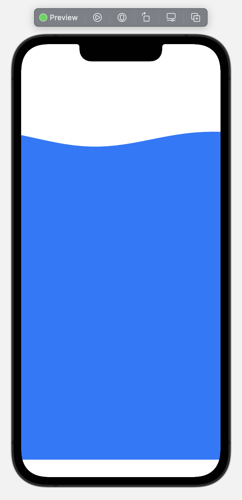
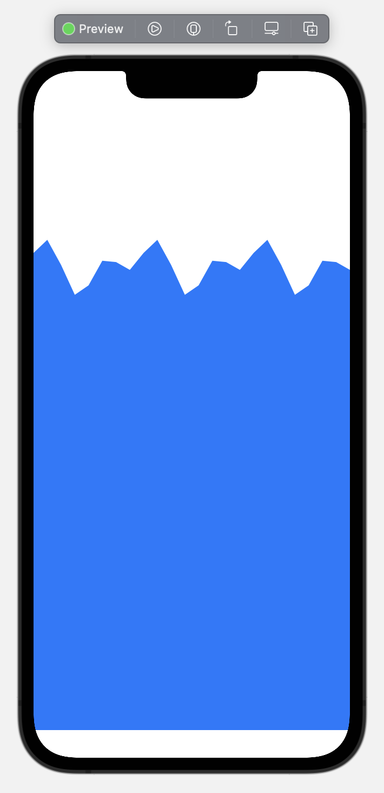
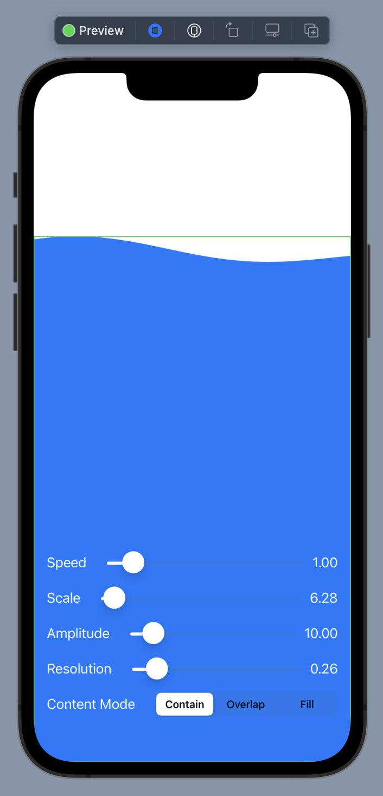

<p align="center">
  <a href="#">
    
  </a>
  <p align="center">
   
  </p>
  <h1 align="center"><b>LiquidShape</b></h1>
  <p align="center" style="font-size: 1.5rem">
    An animated liquid shape for SwiftUI.
    <br />
    <br />
  </p>
</p>



```swift
import SwiftUI
import LiquidShape

struct MyView: View {
  var body: some View {
    Liquid()
      .foregroundColor(.blue)
    
    // or
    Liquid(speed: 0.5)
  }
}
```

### Advanced
For advanced use, check out the Shape itself.



```swift
TimelineView(.animation) { ctx in
  Liquid.Shape(
    time: 4 * ctx.date.timeIntervalSince1970,
    scale: 12 * .pi,
    amplitude: 20,
    contentMode: .contain,
    resolution: .pi / 2
  )
}
```



To experiment with parameters, use the included debug view.

```swift
Liquid.debug()
```


## Install
LiquidShape is a Swift Package. Add via Xcode `File > Add Packages...` or drop this in your Package.swift dependencies:
```swift
.package(url: "https://github.com/ValentinWalter/LiquidShape/", from: "1.0.0")
```
